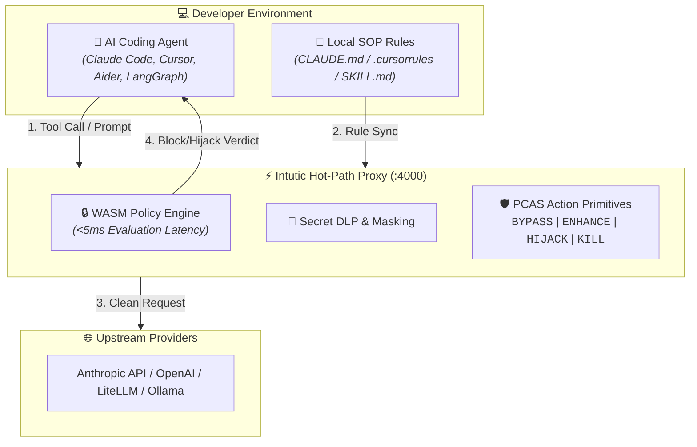

<div align="center">

# Intutic — The Circuit Breaker for AI Agents

**Real-time security, secret DLP, and loop burn prevention for autonomous AI coding agents.**

[](https://github.com/intutic/intutic)
[](https://opensource.org/licenses/MIT)
[](https://docs.intutic.ai)
[](https://intutic.ai)
[](https://join.slack.com/t/intutic/shared_invite/zt-44mbgg651-0g1B6PkRTfvh2so3fXhnnA)
[](https://x.com/IntuticAI)

[Website](https://intutic.ai) • [Documentation](https://docs.intutic.ai) • [Main Repository](https://github.com/intutic/intutic) • [Slack](https://join.slack.com/t/intutic/shared_invite/zt-44mbgg651-0g1B6PkRTfvh2so3fXhnnA)

</div>

---

## 💡 About Intutic

Existing AI observability tools are **passive** — they log execution data *after* an agent leaks a secret, deletes production files, or runs into infinite loops.

**Intutic is an active, low-latency circuit breaker.** It sits directly in the tool-call path between AI coding assistants and local shell / production APIs. Every tool execution undergoes sub-5ms policy evaluation — blocking dangerous commands before they execute and steering agentic loops in real time.

---

## 📦 Key Repositories in the Intutic Ecosystem

| Repository | Description | Stars / Status |
| :--- | :--- | :--- |
| 🛡️ [**`intutic/intutic`**](https://github.com/intutic/intutic) | The primary open-core repository containing the Rust Proxy, `@intutic/cli`, `@intutic/clawde` SDK, and WASM Rules Engine. | [](https://github.com/intutic/intutic) |
| 🌐 [**`intutic/website`**](https://github.com/intutic/website) | Public marketing website source for [intutic.ai](https://intutic.ai). | [](https://opensource.org/licenses/MIT) |

---

## 🏗️ Architecture Overview



---

## ⚡ Quickstart (30 Seconds)

### 1. Install Global CLI & Native Proxy
```bash
npm install -g @intutic/cli @intutic/proxy
```

### 2. Connect Your Project
```bash
intutic connect
```

### 3. Route Your Agent
```bash
export ANTHROPIC_BASE_URL="http://localhost:4000/v1"
export OPENAI_BASE_URL="http://localhost:4000/v1"
```

---

## 🔌 Supported Harnesses & Frameworks

Intutic provides zero-code-change governance across **18+ AI tools**:

* **Single-Agent Assistants:** Claude Code CLI, Cursor, Windsurf, Aider, Antigravity, Cline, Roo Code, Codex, OpenWebUI, Goose, Continue.
* **Multi-Agent Frameworks:** LangGraph, CrewAI, AutoGen, OpenHands, OpenClaw, Hermes, n8n.

---

## 🌐 Community & Links

* 📖 **Documentation Portal:** [docs.intutic.ai](https://docs.intutic.ai)
* 🌐 **Official Website:** [intutic.ai](https://intutic.ai)
* 💬 **Slack Community:** [Join Intutic Slack](https://join.slack.com/t/intutic/shared_invite/zt-44mbgg651-0g1B6PkRTfvh2so3fXhnnA)
* 🐤 **Follow on X:** [@IntuticAI](https://x.com/IntuticAI)
* 💼 **LinkedIn Page:** [Intutic on LinkedIn](https://www.linkedin.com/company/intutic-ai/)
* 📧 **Contact Support:** [support@intutic.ai](mailto:support@intutic.ai)

---

<div align="center">

© 2026 Intutic Community. All rights reserved. Licensed under the [MIT License](https://opensource.org/licenses/MIT).

</div>
