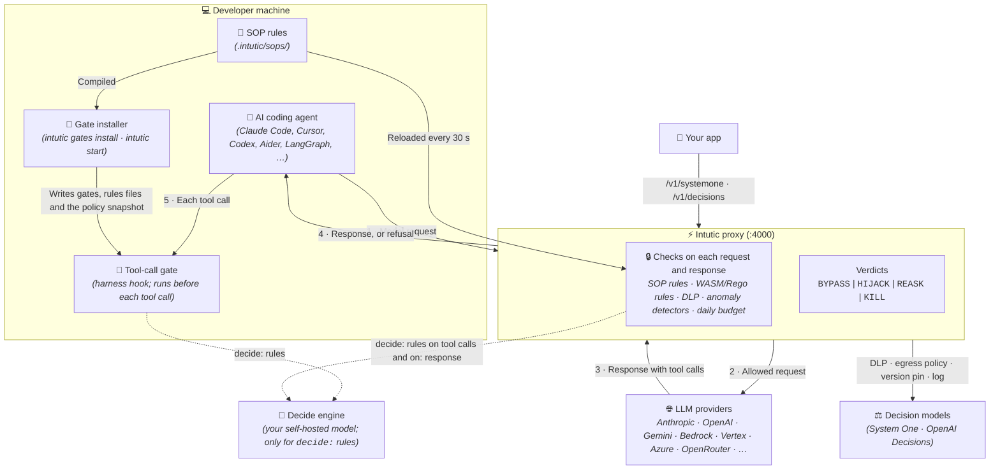

<div align="center">

# Intutic — The Circuit Breaker for AI Agents

**Policy as code for AI agents: your rules are files in git, enforced at the tool call across 43 agent harnesses.**

[](https://github.com/intutic/intutic)
[](https://www.npmjs.com/package/@intutic/cli)
[](https://opensource.org/licenses/MIT)
[](https://docs.intutic.ai)
[](https://intutic.ai)
[](https://x.com/IntuticAI)

[Website](https://intutic.ai) • [Documentation](https://docs.intutic.ai) • [Main Repository](https://github.com/intutic/intutic)


</div>

---

## 💡 About Intutic

Observability tools log what an agent did *after* it leaked a secret, deleted files or looped on a paid API.

**Intutic is an active circuit breaker at the tool call.** Your rules are Markdown files in `.intutic/sops/`. In 36 of the 43 supported harnesses, a gate checks every tool call against them before it runs; a local proxy covers the rest and checks the model traffic as well. Dangerous commands are refused, secrets are redacted, and loops are steered or stopped. The policy check is a rule decision, not a model call; rules that need a judgement can ask your own self-hosted model.

What a rule can say, among other things:

* **`allow_commands:`** only the shell commands on the list run; anything else is refused.
* **`requires_before:` / `forbid_after:`** ordering between steps, such as no deploy without a passing test run since the last change. The proxy refuses the call before it runs.
* **`scope_paths_mode: enforce`** writes outside the allowed paths are refused.
* **`decide:`** narrow yes/no questions about a tool call or a response, answered by your own self-hosted model, in shadow until you pin it to a model.

Every key is in the [SOP front matter reference](https://docs.intutic.ai/reference/sop-front-matter).

---

## 📦 Key Repositories in the Intutic Ecosystem

| Repository | Description | Stars / Status |
| :--- | :--- | :--- |
| 🛡️ [**`intutic/intutic`**](https://github.com/intutic/intutic) | The open-core repository: the Rust proxy, `@intutic/cli`, the tool-call gates (`@intutic/gate` for TypeScript, `intutic-clawde` for Python), the `@intutic/clawde` client SDK, the MCP governance proxy and the WASM rules SDK. | [](https://github.com/intutic/intutic) |
| 🧱 [**`intutic/terraform-provider-intutic`**](https://github.com/intutic/terraform-provider-intutic) | The Terraform provider, published from `packages/terraform-provider-intutic` in the open-core repository. | [](https://github.com/intutic/terraform-provider-intutic) |

---

## 🏗️ Architecture Overview


```mermaid
flowchart TD
    subgraph Dev[" 💻 Developer machine "]
        Agent["🤖 AI coding agent<br><i>(Claude Code, Cursor, Codex, Aider, LangGraph, …)</i>"]
        SOP["📝 SOP rules<br><i>(.intutic/sops/)</i>"]
        Installer["🧩 Gate installer<br><i>(intutic gates install · intutic start)</i>"]
        Gate["🚦 Tool-call gate<br><i>(harness hook; runs before each tool call)</i>"]
    end

    subgraph Proxy[" ⚡ Intutic proxy (:4000) "]
        Checks["🔒 Checks on each request and response<br><i>SOP rules · WASM/Rego rules · DLP · anomaly detectors · daily budget</i>"]
        Verdicts["Verdicts<br><code>BYPASS</code> | <code>HIJACK</code> | <code>REASK</code> | <code>KILL</code>"]
    end

    Providers["🌐 LLM providers<br><i>Anthropic · OpenAI · Gemini · Bedrock · Vertex · Azure · OpenRouter · …</i>"]
    Decide["🧠 Decide engine<br><i>(your self-hosted model; only for <code>decide:</code> rules)</i>"]
    App["🧾 Your app"]
    DecisionModels["⚖️ Decision models<br><i>(System One · OpenAI Decisions)</i>"]

    Agent -->|1 · Model request| Proxy
    Proxy -->|2 · Allowed request| Providers
    Providers -->|3 · Response with tool calls| Proxy
    Proxy -->|4 · Response, or refusal| Agent
    Agent -->|5 · Each tool call| Gate
    SOP -->|Reloaded every 30 s| Checks
    SOP -->|Compiled| Installer
    Installer -->|Writes gates, rules files and the policy snapshot| Gate
    Gate -.->|"decide: rules"| Decide
    Checks -.->|"decide: rules on tool calls and on: response"| Decide
    App -->|"/v1/systemone · /v1/decisions"| Proxy
    Proxy -->|DLP · egress policy · version pin · log| DecisionModels
```

---

## ⚡ Quickstart (30 Seconds)

### 1. Install Global CLI & Native Proxy
```bash
npm install -g @intutic/cli @intutic/proxy
```

### 2. Install the Gates
```bash
intutic init
intutic gates install
```
This detects the coding agents in your project and installs a blocking gate in each.

### 3. Start the Proxy
```bash
intutic start
```
No account, no Docker, no config file. Everything runs on your machine.

### 4. Route Your Agent
```bash
# Anthropic SDK and Claude Code append /v1/messages themselves — host only.
export ANTHROPIC_BASE_URL="http://localhost:4000"
export OPENAI_BASE_URL="http://localhost:4000/v1"
```
Or launch the agent with `intutic exec -- <agent>`, or run `intutic gates install --route` to write the proxy URL into the configs of the agents that have a setting for it.

---

## 🔌 Supported Harnesses & Frameworks

Intutic ships **43 harness adapters**:

* **Native hook gates** (no change to your agent's code): Claude Code, Cursor, Windsurf, Cline, Codex, Goose, GitHub Copilot, OpenCode and more.
* **SDK-gated frameworks** (an in-process gate you add to your agent): LangGraph, LangChain, CrewAI, AutoGen, AG2, Google ADK, OpenAI Agents SDK, Pydantic AI, smolagents, AWS Strands Agents, Microsoft Agent Framework, Mastra, Vercel AI SDK and more.
* **Through the proxy alone:** Aider, Claude Desktop, Roo Code, Continue (these also use the MCP governance proxy where they have MCP), and anything else that honours `OPENAI_BASE_URL` or `ANTHROPIC_BASE_URL`.

The full list is in the [main repository](https://github.com/intutic/intutic#-supported-harnesses--frameworks).

---

## 🌐 Community & Links

* 📖 **Documentation Portal:** [docs.intutic.ai](https://docs.intutic.ai)
* 🌐 **Official Website:** [intutic.ai](https://intutic.ai)
* 🐤 **Follow on X:** [@IntuticAI](https://x.com/IntuticAI)
* 💼 **LinkedIn Page:** [Intutic on LinkedIn](https://www.linkedin.com/company/intutic-ai/)
* 📧 **Contact Support:** [support@intutic.ai](mailto:support@intutic.ai)

---

<div align="center">

© 2026 Intutic Community. All rights reserved. Licensed under the [MIT License](https://opensource.org/licenses/MIT).

</div>
